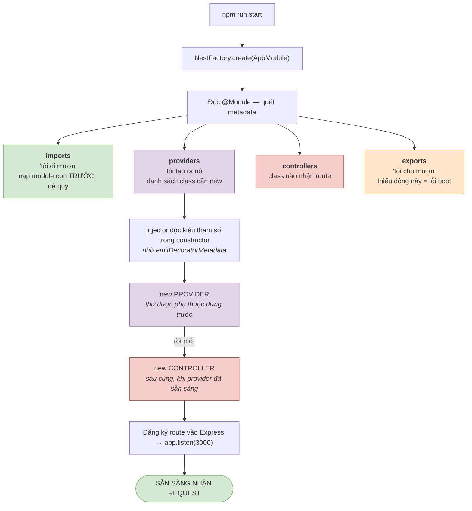
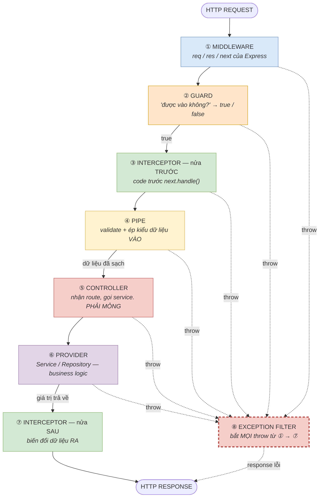
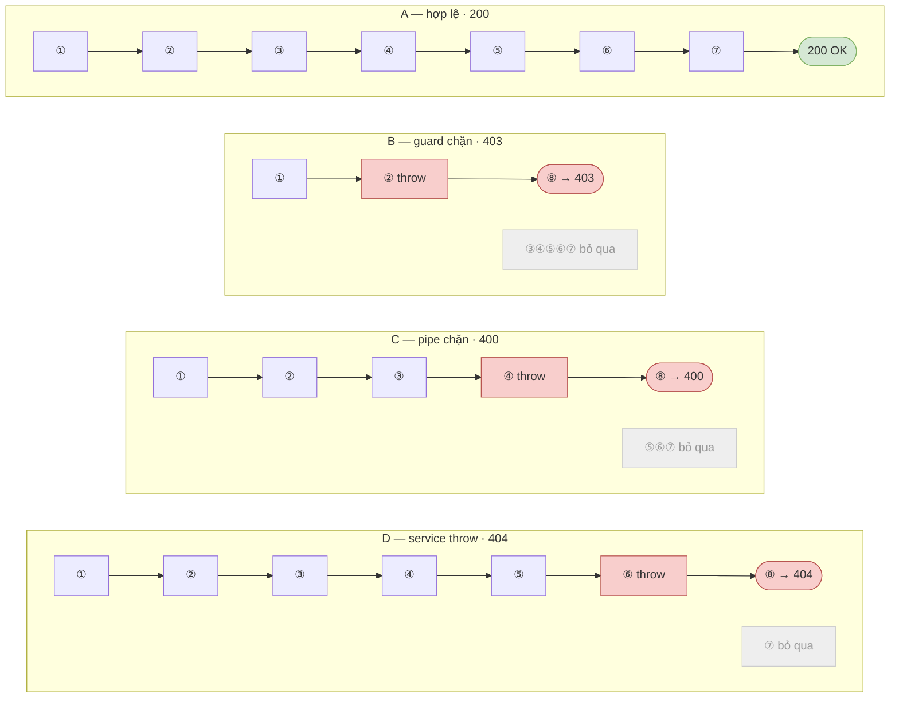

# Bài 12 — Sơ đồ luồng dữ liệu: 8 khối của NestJS

> File này trả lời đúng một câu hỏi: **một request đi qua những đâu, theo thứ tự nào, và ai chạy khi nào.**
> Bài 01 và bài 05 dạy từng khối riêng lẻ. File này ghép tất cả lại thành một bức tranh, và **chứng minh thứ tự bằng log thật** chứ không nói suông.
>
> Toàn bộ log trong file này lấy từ một app NestJS 11 chạy thật (`@nestjs/common` 11.1.29, `class-validator` 0.15.1, Node 20.14.0). Mã nguồn đầy đủ ở mục 9 — bạn copy về chạy lại sẽ ra đúng những dòng này.

## 📐 Sơ đồ rời (.mmd)

Ba sơ đồ trong file này cũng được tách ra thành file `.mmd` riêng ở thư mục [`so-do/`](./so-do/), để bạn mở/sửa/xuất ảnh độc lập:

| File | Nội dung |
|---|---|
| [so-do/1-luong-request.mmd](./so-do/1-luong-request.mmd) | 8 khối xếp dọc + nhánh `throw` đi vào Exception filter |
| [so-do/2-luong-khoi-dong.mmd](./so-do/2-luong-khoi-dong.mmd) | `NestFactory.create` → đọc `@Module` → `new` provider → `new` controller |
| [so-do/3-bon-kich-ban.mmd](./so-do/3-bon-kich-ban.mmd) | Chốt nào **chạy**, chốt nào **bị bỏ qua** trong 4 case A/B/C/D |

Phần ghi chú kèm theo mỗi sơ đồ nằm trong comment `%%` ở cuối từng file — mermaid bỏ qua khi vẽ, bạn vẫn đọc được khi mở file.

Cách xem:

- **VS Code** — cài extension *Markdown Preview Mermaid Support* (`bierner.markdown-mermaid`) là các sơ đồ trong file `.md` này hiện luôn ở khung preview. Muốn xem riêng file `.mmd` thì cài thêm *Mermaid Editor* hoặc *Mermaid Preview*.
- **Trình duyệt** — dán nội dung file vào [mermaid.live](https://mermaid.live), sửa và tải về PNG/SVG.
- **Xuất ảnh bằng CLI**:

  ```bash
  npx -y @mermaid-js/mermaid-cli -i so-do/1-luong-request.mmd -o 1-luong-request.png -w 1600 -b white
  ```

Nội dung ba file `.mmd` đó giống hệt các sơ đồ nhúng bên dưới — đọc thẳng ở đây là đủ.

---

## 1. Hai luồng khác nhau, đừng lẫn

NestJS có **hai luồng dữ liệu** hoàn toàn tách biệt. Nhầm lẫn giữa chúng là nguồn gốc của hầu hết mọi bối rối lúc mới học.

| | Luồng khởi động (bootstrap) | Luồng request |
|---|---|---|
| Chạy khi nào | **Một lần duy nhất**, lúc `npm run start` | **Mỗi lần** có HTTP request |
| Ai đóng vai chính | **Module, Provider** | **Middleware → Guard → Interceptor → Pipe → Controller → Provider → Interceptor → Filter** |
| Việc nó làm | Đọc `@Module`, dựng cây phụ thuộc, `new` tất cả các class | Đưa dữ liệu qua từng chốt rồi trả response |
| Hỏng thì sao | App **không lên được**, chết ngay lúc boot | Trả về lỗi HTTP (403 / 400 / 500...) |

- **Module + Provider** thuộc luồng khởi động → mục 2.
- **6 khối còn lại** thuộc luồng request → mục 3 trở đi.

---

## 2. Luồng khởi động — Module và Provider

### 2.1. Sơ đồ



### 2.2. Chạy thật để thấy thứ tự

Hai module: `UsersModule` giữ `UsersService`, `AppModule` có `PostsService` cần `UsersService`.

```ts
@Injectable()
class UsersService {
  constructor() { console.log('  -> new UsersService'); }
}

@Module({ providers: [UsersService], exports: [UsersService] })
class UsersModule {}

@Injectable()
class PostsService {
  constructor(private readonly users: UsersService) { console.log('  -> new PostsService'); }
}

@Controller('posts')
class PostsController {
  constructor(private readonly posts: PostsService) { console.log('  -> new PostsController'); }
  @Get() all() { return []; }
}

@Module({ imports: [UsersModule], controllers: [PostsController], providers: [PostsService] })
class AppModule {}
```

Output thật khi chạy `node dist/di.js`:

```
[Nest] LOG [NestFactory] Starting Nest application...
  -> new UsersService
  -> new PostsService
[Nest] LOG [InstanceLoader] UsersModule dependencies initialized +5ms
  -> new PostsController
[Nest] LOG [InstanceLoader] AppModule dependencies initialized +1ms
BOOT OK
```

Đọc được 3 điều từ 6 dòng này:

1. `UsersService` được `new` **trước** `PostsService` — Nest luôn dựng thứ được phụ thuộc trước.
2. `PostsController` được `new` **sau cùng**, sau khi mọi provider nó cần đã sẵn sàng. Đây là lý do trong controller bạn dùng `this.postsService` được ngay mà không cần kiểm tra `null`.
3. Mỗi class chỉ in **một dòng** → Nest chỉ `new` một lần cho cả vòng đời app (singleton). Không phải mỗi request một instance.

### 2.3. Quên `exports` — lỗi kinh điển, output thật

Xoá `exports: [UsersService]` khỏi `UsersModule` rồi chạy lại:

```
[Nest] LOG [NestFactory] Starting Nest application...
  -> new UsersService
[Nest] LOG [InstanceLoader] UsersModule dependencies initialized +6ms
[Nest] ERROR [ExceptionHandler] UnknownDependenciesException [Error]: Nest can't resolve
dependencies of the PostsService (?). Please make sure that the argument UsersService at
index [0] is available in the AppModule module.

Potential solutions:
- Is AppModule a valid NestJS module?
- If UsersService is a provider, is it part of the current AppModule?
- If UsersService is exported from a separate @Module, is that module imported within AppModule?
```

Cách đọc thông báo này:

| Mảnh trong log | Nghĩa |
|---|---|
| `PostsService (?)` | dấu `?` là **tham số bị thiếu**. `(?)` = tham số thứ nhất hỏng. Nếu là `(UsersService, ?)` thì tham số thứ hai mới hỏng. |
| `at index [0]` | vị trí tham số trong constructor, đếm từ 0 |
| `available in the AppModule module` | module đang cần, tức nơi bạn phải sửa |

Chú ý: `UsersService` vẫn được `new` thành công, `UsersModule` vẫn init xong. Nó tồn tại — chỉ là **không ai ngoài `UsersModule` với tới được**. `exports` chính là cái cổng đó.

> Quy tắc gọn: `providers` = "tôi tạo ra nó", `exports` = "tôi cho mượn", `imports` = "tôi đi mượn". Muốn dùng service của module khác thì cần đủ **cả hai vế**: bên kia `exports`, bên này `imports`.

---

## 3. Luồng request — sơ đồ đầy đủ



Ghi chú kèm theo từng khối:

| Khối | Đặc điểm quan trọng nhất |
|---|---|
| ① Middleware | **Chưa biết** sẽ vào controller nào — không có `ExecutionContext` |
| ② Guard | Ghi `req.user` ở đây. Lúc này `@Body` **chưa** validate, `@Param('id')` **vẫn** là string |
| ③ Interceptor trước | Nếu ④ hỏng thì ⑦ **không** chạy → dùng `finalize()` chứ đừng dùng `tap()` |
| ④ Pipe | Sau bước này `"7"` mới thành `7`, `@Body` mới thành instance của DTO |
| ⑤ Controller | Mỗi method lý tưởng chỉ 1 dòng gọi service |
| ⑥ Provider | Được `new` sẵn từ lúc boot (singleton), không phải mỗi request một instance |
| ⑦ Interceptor sau | Chuẩn hoá `{ data, meta }`, ghi cache, commit transaction |
| ⑧ Filter | Throw ở bất kỳ đâu → **nhảy thẳng** xuống đây, bỏ qua phần còn lại |

Điểm mấu chốt dễ nhớ nhầm: **Guard chạy TRƯỚC Pipe.** Nghĩa là lúc guard chạy, `@Body()` **chưa được validate**, `@Param('id')` **vẫn còn là string**. Đừng viết guard mà tin rằng dữ liệu đã sạch.

---

## 4. Chứng minh thứ tự bằng log thật

App demo cắm một dòng `console.log` vào từng khối (mã đầy đủ ở mục 9), rồi bắn 4 request thật bằng `curl`.

### Case A — mọi thứ hợp lệ

```bash
curl -X POST http://localhost:3000/posts \
  -H 'content-type: application/json' \
  -H 'x-api-key: secret123' \
  -d '{"title":"Hoc NestJS","authorId":1}'
```

Log server:

```
[1] MIDDLEWARE   POST /posts
[2] GUARD        kiem tra header x-api-key = secret123
[3] INTERCEPTOR  truoc handler
[4] PIPE         body OK -> {"title":"Hoc NestJS","authorId":1}
[5] CONTROLLER   PostsController.create
[6] PROVIDER     PostsService.create({"title":"Hoc NestJS","authorId":1})
[7] INTERCEPTOR  sau handler
```

Response:

```json
{"id":99,"title":"Hoc NestJS","authorId":1}
```

Đủ 7 chốt, đúng thứ tự sơ đồ. Filter không chạy vì không có lỗi.

### Case B — Guard chặn (thiếu `x-api-key`)

```bash
curl -X POST http://localhost:3000/posts \
  -H 'content-type: application/json' \
  -d '{"title":"Hoc NestJS","authorId":1}'
```

```
[1] MIDDLEWARE   POST /posts
[2] GUARD        kiem tra header x-api-key = (khong co)
[8] FILTER       bat exception -> HTTP 403
```

```json
{"statusCode":403,"path":"/posts","message":"Thieu hoac sai x-api-key"}
```

**Từ `[2]` nhảy thẳng sang `[8]`.** Interceptor, Pipe, Controller, Service — không cái nào chạy. Đây là lý do đặt việc kiểm tra quyền ở Guard chứ không ở đầu Service: chặn được sớm nhất, tiết kiệm nhất.

### Case C — Pipe chặn (body sai)

```bash
curl -X POST http://localhost:3000/posts \
  -H 'content-type: application/json' -H 'x-api-key: secret123' \
  -d '{"title":"","authorId":0}'
```

```
[1] MIDDLEWARE   POST /posts
[2] GUARD        kiem tra header x-api-key = secret123
[3] INTERCEPTOR  truoc handler
[4] PIPE         ValidationPipe THAT BAI
[8] FILTER       bat exception -> HTTP 400
```

```json
{"statusCode":400,"path":"/posts","message":["title should not be empty","authorId must not be less than 1"]}
```

Khác Case B ở chỗ: `[3]` **đã chạy rồi** mới hỏng ở `[4]`. Nên nếu interceptor của bạn mở transaction ở nửa trước, hãy nhớ nó có thể không bao giờ tới nửa sau `[7]` — phải dọn dẹp bằng `catchError`/`finalize`, không phải bằng `tap`.

Cũng chú ý `message` là **mảng** — mặc định `ValidationPipe` gom tất cả lỗi chứ không dừng ở lỗi đầu tiên.

### Case D — Service ném lỗi

```bash
curl http://localhost:3000/posts/7 -H 'x-api-key: secret123'
```

```
[1] MIDDLEWARE   GET /posts/7
[2] GUARD        kiem tra header x-api-key = secret123
[3] INTERCEPTOR  truoc handler
[4] PIPE         param OK -> 7
[5] CONTROLLER   PostsController.findOne
[6] PROVIDER     PostsService.findOne(7) - typeof id = number
[8] FILTER       bat exception -> HTTP 404
```

```json
{"statusCode":404,"path":"/posts/7","message":"Khong tim thay post id=7"}
```

Hai điều đáng giá ở đây:

- `typeof id = number` — URL `/posts/7` là **string** `"7"`, `ParseIntPipe` đã đổi nó thành số ở bước `[4]`. Service nhận đúng kiểu mà không cần `+id`.
- `[7]` **không xuất hiện**. Service throw → nửa sau của interceptor bị bỏ qua, nhảy thẳng xuống `[8]`.

### Bảng tổng kết 4 case

| Case | Chốt đã chạy | Chốt bị bỏ qua | HTTP |
|---|---|---|---|
| A — hợp lệ | 1→2→3→4→5→6→7 | 8 | 200 |
| B — guard chặn | 1→2 | 3,4,5,6,7 | 403 |
| C — pipe chặn | 1→2→3→4 | 5,6,7 | 400 |
| D — service throw | 1→2→3→4→5→6 | 7 | 404 |

Bốn case xếp chồng — hàng càng ngắn nghĩa là hỏng càng sớm:



Nhìn cột "bị bỏ qua": **hỏng càng sớm thì càng ít việc bị lãng phí.** Đó là toàn bộ triết lý của cái pipeline này.

---

## 5. Chọn khối nào — bảng quyết định

Khi phân vân "code này viết ở đâu", đi từ trên xuống, dừng ở dòng đầu tiên đúng:

| Bạn cần… | Dùng | Vì sao không dùng cái khác |
|---|---|---|
| Chặn request theo quyền hạn | **Guard** | Pipe chặn được nhưng trả 400 chứ không phải 403; Middleware không biết route nào, không đọc được `@Roles()` |
| Biến đổi / kiểm tra **dữ liệu vào** | **Pipe** | Interceptor chạy trước pipe, lúc đó dữ liệu chưa sạch |
| Biến đổi **dữ liệu ra** | **Interceptor** | Filter chỉ chạy khi có lỗi |
| Đổi format **mọi lỗi** | **Exception filter** | Không nơi nào khác thấy được lỗi ném từ mọi tầng |
| Đo thời gian, cache, transaction | **Interceptor** | Nó là khối duy nhất bọc được **cả trước lẫn sau** handler |
| Business logic, gọi DB | **Provider** | Controller phải mỏng |
| Nhận route, đọc `@Body`/`@Param` | **Controller** | — |
| Gom nhóm & khai báo | **Module** | — |
| Code Express thuần (helmet, cors, raw body) | **Middleware** | Các khối kia không chạm được vào `res` sớm như vậy |

Cách nhớ ngắn nhất:

```
Guard        → được vào không?      (true / false)
Pipe         → dữ liệu vào sạch chưa?  (biến đổi INPUT)
Interceptor  → cần bọc gì quanh?    (biến đổi OUTPUT + đo/cache)
Filter       → lỗi thì trả gì?      (chỉ khi throw)
Middleware   → không thuộc 4 nhóm trên
```

---

## 6. Ba luồng dữ liệu con hay bị hỏi

### 6.1. Dữ liệu đi kèm request được truyền giữa các khối thế nào

Không có tham số nào truyền tay từ Guard sang Controller. Tất cả gắn vào **object `request`**:

```
Middleware  req.requestId = uuid()          ─┐
Guard       req.user = decodeJwt(token)      │  cùng một object request
Controller  @Req() req  →  req.user          │  chạy suốt vòng đời request
            @CurrentUser() user  ────────────┘  (custom decorator đọc req.user)
```

Đây chính là cách `@UseGuards(JwtAuthGuard)` + `@CurrentUser()` ở bài 06 hoạt động: guard **ghi** vào `req.user`, decorator **đọc** ra. Thứ tự bắt buộc — vì guard (②) chạy trước controller (⑤).

### 6.2. Nhiều khối cùng loại chạy theo thứ tự nào

Với **Guard / Interceptor / Pipe**, Nest chạy theo phạm vi từ rộng đến hẹp:

```
Global  (app.useGlobalGuards / APP_GUARD)
   ↓
Controller  (@UseGuards trên class)
   ↓
Method      (@UseGuards trên method)
   ↓
Param       (chỉ Pipe:  @Param('id', ParseIntPipe))
```

Với **Exception filter** thì **ngược lại**: hẹp thắng rộng. Filter gắn ở method sẽ nuốt lỗi, filter global không thấy nữa.

### 6.3. `APP_GUARD` khác `useGlobalGuards` chỗ nào

```ts
// main.ts — guard KHÔNG inject được gì
app.useGlobalGuards(new JwtAuthGuard());

// app.module.ts — guard inject được (khuyến nghị)
providers: [{ provide: APP_GUARD, useClass: JwtAuthGuard }]
```

Cách đầu bạn tự `new` nên Nest không tham gia → constructor không nhận được `JwtService`, `ConfigService`. Cách sau đi qua injector nên inject bình thường. Cùng logic đó áp cho `APP_PIPE`, `APP_INTERCEPTOR`, `APP_FILTER`.

Trong app demo, filter được đăng ký đúng theo cách này:

```ts
providers: [PostsService, { provide: APP_FILTER, useClass: AllExceptionsFilter }]
```

---

## 7. Ba lỗi sinh ra trực tiếp từ việc hiểu sai luồng

| Triệu chứng | Nguyên nhân theo sơ đồ | Sửa |
|---|---|---|
| Trong Guard, `request.body` rỗng hoặc chưa validate | Guard (②) chạy trước Pipe (④) | Chuyển việc kiểm tra body xuống Pipe hoặc Service |
| Interceptor mở transaction nhưng rò rỉ connection | Pipe hỏng ở (④) → không bao giờ tới (⑦) | Dùng `finalize()`/`catchError()` thay vì `tap()` |
| Filter global không bắt được lỗi | Có filter phạm vi hẹp hơn đã nuốt mất | Bỏ filter ở method, hoặc `throw` tiếp trong đó |

---

## 8. Bài tập

1. Thêm một interceptor thứ hai (`@UseInterceptors(A, B)`) và đoán xem log in ra thứ tự nào ở nửa trước và nửa sau. Chạy để kiểm chứng — nửa sau có đảo ngược không?
2. Đổi `tap()` trong `TimingInterceptor` thành `finalize()`, chạy lại Case C. Dòng `[7]` bây giờ có xuất hiện không? Giải thích bằng sơ đồ mục 3.
3. Thêm `@UseFilters()` với một filter riêng lên method `create`, rồi chạy lại Case C. Filter nào chạy — global hay filter mới?

---

## 9. Mã nguồn app demo

Gộp trong một file cho dễ chạy. Thật ra trong dự án thật bạn tách ra theo `cau-truc-chuan.md`.

Cài đặt:

```bash
mkdir flowdemo && cd flowdemo && npm init -y
npm i @nestjs/common @nestjs/core @nestjs/platform-express reflect-metadata rxjs class-validator class-transformer
npm i -D typescript @types/node @types/express
```

`tsconfig.json` — hai dòng `experimentalDecorators` và `emitDecoratorMetadata` là bắt buộc, thiếu thì DI không chạy:

```json
{
  "compilerOptions": {
    "module": "commonjs",
    "target": "ES2021",
    "experimentalDecorators": true,
    "emitDecoratorMetadata": true,
    "esModuleInterop": true,
    "strictNullChecks": true,
    "rootDir": "./src",
    "outDir": "./dist"
  }
}
```

`src/main.ts`:

```ts
import 'reflect-metadata';
import {
  Body, CanActivate, Controller, ExceptionFilter, ExecutionContext, Get,
  Injectable, Module, NestInterceptor, NestMiddleware, NestModule,
  MiddlewareConsumer, CallHandler, Catch, ArgumentsHost, HttpException,
  Param, ParseIntPipe, Post, UseGuards, UseInterceptors, ValidationPipe,
  ForbiddenException, NotFoundException,
} from '@nestjs/common';
import { NestFactory, APP_FILTER } from '@nestjs/core';
import { Observable, tap } from 'rxjs';
import { IsInt, IsNotEmpty, IsString, Min } from 'class-validator';
import { Request, Response, NextFunction } from 'express';

const log = (s: string) => console.log(s);

// ── ① MIDDLEWARE ─────────────────────────────────────────────────
@Injectable()
class LoggerMiddleware implements NestMiddleware {
  use(req: Request, res: Response, next: NextFunction) {
    log(`[1] MIDDLEWARE   ${req.method} ${req.originalUrl}`);
    next();                       // quên next() → request treo vĩnh viễn
  }
}

// ── ② GUARD ──────────────────────────────────────────────────────
@Injectable()
class ApiKeyGuard implements CanActivate {
  canActivate(ctx: ExecutionContext): boolean {
    const req = ctx.switchToHttp().getRequest<Request>();
    log(`[2] GUARD        kiem tra header x-api-key = ${req.headers['x-api-key'] ?? '(khong co)'}`);
    if (req.headers['x-api-key'] !== 'secret123') {
      throw new ForbiddenException('Thieu hoac sai x-api-key');
    }
    return true;
  }
}

// ── ③⑦ INTERCEPTOR ───────────────────────────────────────────────
@Injectable()
class TimingInterceptor implements NestInterceptor {
  intercept(ctx: ExecutionContext, next: CallHandler): Observable<any> {
    log('[3] INTERCEPTOR  truoc handler');
    return next.handle().pipe(tap(() => log('[7] INTERCEPTOR  sau handler')));
  }
}

// ── ④ PIPE ───────────────────────────────────────────────────────
class CreatePostDto {
  @IsString() @IsNotEmpty()
  title!: string;

  @IsInt() @Min(1)
  authorId!: number;
}

// bọc ValidationPipe chỉ để in log — dự án thật dùng thẳng ValidationPipe
@Injectable()
class LoggingValidationPipe extends ValidationPipe {
  async transform(value: any, metadata: any) {
    const out = await super.transform(value, metadata);
    log(`[4] PIPE         ${metadata.type} OK -> ${JSON.stringify(out)}`);
    return out;
  }
}

// ── ⑥ PROVIDER ───────────────────────────────────────────────────
@Injectable()
class PostsService {
  create(dto: CreatePostDto) {
    log(`[6] PROVIDER     PostsService.create(${JSON.stringify(dto)})`);
    return { id: 99, ...dto };
  }
  findOne(id: number) {
    log(`[6] PROVIDER     PostsService.findOne(${id}) - typeof id = ${typeof id}`);
    if (id !== 1) throw new NotFoundException(`Khong tim thay post id=${id}`);
    return { id: 1, title: 'Bai viet dau tien' };
  }
}

// ── ⑤ CONTROLLER ─────────────────────────────────────────────────
@UseGuards(ApiKeyGuard)
@UseInterceptors(TimingInterceptor)
@Controller('posts')
class PostsController {
  constructor(private readonly postsService: PostsService) {}

  @Post()
  create(@Body() dto: CreatePostDto) {
    log('[5] CONTROLLER   PostsController.create');
    return this.postsService.create(dto);
  }

  @Get(':id')
  findOne(@Param('id', ParseIntPipe) id: number) {
    log('[5] CONTROLLER   PostsController.findOne');
    return this.postsService.findOne(id);
  }
}

// ── ⑧ EXCEPTION FILTER ───────────────────────────────────────────
@Catch()                          // @Catch() rỗng = bắt MỌI exception
class AllExceptionsFilter implements ExceptionFilter {
  catch(exception: unknown, host: ArgumentsHost) {
    const res = host.switchToHttp().getResponse<Response>();
    const req = host.switchToHttp().getRequest<Request>();
    const status = exception instanceof HttpException ? exception.getStatus() : 500;
    const message =
      exception instanceof HttpException
        ? (exception.getResponse() as any).message ?? exception.message
        : 'Loi he thong';
    log(`[8] FILTER       bat exception -> HTTP ${status}`);
    res.status(status).json({ statusCode: status, path: req.originalUrl, message });
  }
}

// ── MODULE ───────────────────────────────────────────────────────
@Module({
  controllers: [PostsController],
  providers: [PostsService, { provide: APP_FILTER, useClass: AllExceptionsFilter }],
})
class AppModule implements NestModule {
  configure(consumer: MiddlewareConsumer) {
    consumer.apply(LoggerMiddleware).forRoutes('*');
  }
}

async function bootstrap() {
  const app = await NestFactory.create(AppModule, { logger: false });
  app.useGlobalPipes(
    new LoggingValidationPipe({
      transform: true,            // bật thì @Param mới ra number, @Body mới thành instance DTO
      whitelist: true,            // xoá field thừa không khai báo trong DTO
      exceptionFactory: (errors) => {
        log('[4] PIPE         ValidationPipe THAT BAI');
        return new HttpException(
          { message: errors.flatMap((e) => Object.values(e.constraints ?? {})) },
          400,
        );
      },
    }),
  );
  await app.listen(3000);
  log('server ready');
}
bootstrap();
```

Chạy:

```bash
npx tsc && node dist/main.js
```

Rồi bắn 4 lệnh `curl` ở mục 4 trong terminal khác, xem log ở terminal chạy server.

---

## Xem thêm

- [01-kien-truc-nestjs.md](./01-kien-truc-nestjs.md) — chi tiết Module / Controller / Provider
- [03-provider-va-di.md](./03-provider-va-di.md) — custom provider, scope, circular dependency
- [05-middleware-guard-interceptor.md](./05-middleware-guard-interceptor.md) — chi tiết từng khối của luồng request
- [10-loi-thuong-gap.md](./10-loi-thuong-gap.md) — 20 lỗi kinh điển
